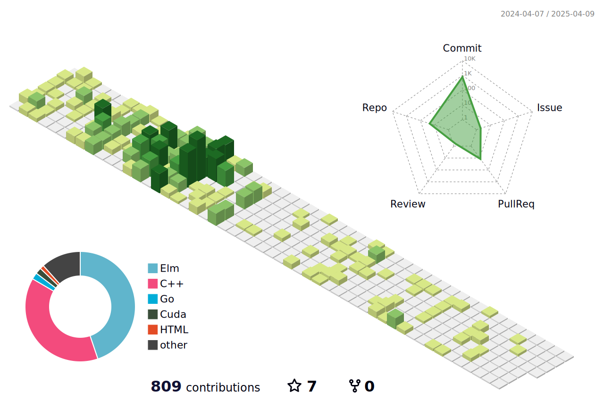

## **About Me:**

<!--START_SECTION:waka-->


**🐱 My GitHub Data** 

> 📦 203.7 kB Used in GitHub's Storage 
 > 
> 🏆 368 Contributions in the Year 2024
 > 
> 🚫 Not Opted to Hire
 > 
> 📜 12 Public Repositories 
 > 
> 🔑 8 Private Repositories 
 > 
**I'm an Early 🐤** 

```text
🌞 Morning                72 commits          ████░░░░░░░░░░░░░░░░░░░░░   14.37 % 
🌆 Daytime                213 commits         ███████████░░░░░░░░░░░░░░   42.51 % 
🌃 Evening                192 commits         ██████████░░░░░░░░░░░░░░░   38.32 % 
🌙 Night                  24 commits          █░░░░░░░░░░░░░░░░░░░░░░░░   04.79 % 
```
📅 **I'm Most Productive on Tuesday** 

```text
Monday                   62 commits          ███░░░░░░░░░░░░░░░░░░░░░░   12.38 % 
Tuesday                  109 commits         █████░░░░░░░░░░░░░░░░░░░░   21.76 % 
Wednesday                102 commits         █████░░░░░░░░░░░░░░░░░░░░   20.36 % 
Thursday                 96 commits          █████░░░░░░░░░░░░░░░░░░░░   19.16 % 
Friday                   62 commits          ███░░░░░░░░░░░░░░░░░░░░░░   12.38 % 
Saturday                 35 commits          ██░░░░░░░░░░░░░░░░░░░░░░░   06.99 % 
Sunday                   35 commits          ██░░░░░░░░░░░░░░░░░░░░░░░   06.99 % 
```


📊 **This Week I Spent My Time On** 

```text
🕑︎ Time Zone: Asia/Shanghai

💬 Programming Languages: 
C++                      7 hrs 10 mins       ████████████░░░░░░░░░░░░░   46.31 % 
Elm                      5 hrs 23 mins       █████████░░░░░░░░░░░░░░░░   34.78 % 
Go                       1 hr 52 mins        ███░░░░░░░░░░░░░░░░░░░░░░   12.10 % 
Other                    26 mins             █░░░░░░░░░░░░░░░░░░░░░░░░   02.89 % 
Markdown                 18 mins             █░░░░░░░░░░░░░░░░░░░░░░░░   02.01 % 

🔥 Editors: 
VS Code                  14 hrs 26 mins      ███████████████████████░░   92.01 % 
GoLand                   45 mins             █░░░░░░░░░░░░░░░░░░░░░░░░   04.84 % 
IntelliJ IDEA            16 mins             ░░░░░░░░░░░░░░░░░░░░░░░░░   01.71 % 
Intellijidea             13 mins             ░░░░░░░░░░░░░░░░░░░░░░░░░   01.42 % 
Neovim                   0 secs              ░░░░░░░░░░░░░░░░░░░░░░░░░   00.03 % 

🐱‍💻 Projects: 
EECS281                  7 hrs 12 mins       ████████████░░░░░░░░░░░░░   46.51 % 
Project2                 5 hrs 23 mins       █████████░░░░░░░░░░░░░░░░   34.79 % 
jcourse_go               2 hrs 7 mins        ███░░░░░░░░░░░░░░░░░░░░░░   13.74 % 
p2team15                 25 mins             █░░░░░░░░░░░░░░░░░░░░░░░░   02.71 % 
jcourse_vite             11 mins             ░░░░░░░░░░░░░░░░░░░░░░░░░   01.28 % 

💻 Operating System: 
Linux                    15 hrs 28 mins      █████████████████████████   100.00 % 
```

**I Mostly Code in C++** 

```text
C++                      6 repos             █████████░░░░░░░░░░░░░░░░   37.50 % 
C                        2 repos             ███░░░░░░░░░░░░░░░░░░░░░░   12.50 % 
Java                     1 repo              ██░░░░░░░░░░░░░░░░░░░░░░░   06.25 % 
Elm                      1 repo              ██░░░░░░░░░░░░░░░░░░░░░░░   06.25 % 
Go                       1 repo              ██░░░░░░░░░░░░░░░░░░░░░░░   06.25 % 
```


**Timeline**


 Last Updated on 12/07/2024 05:31:15 UTC
<!--END_SECTION:waka-->

🔭 My name is Risc_lt, a trivial undergraduate student from **@SJTU** and maybe somehow also **@UMich**. 

💻 I’ve learnt a litte **Deep Learning**, **Full-stack development**, **Operating System** and **Database**.

🌏 I’m currently working on **Bustub-KV**, **jCourse** and **Elm Game**.

📜 I'm a big fan of **Golden State Warrior** and I enjoy listenning to **popular music** as well as playing **video games**.

🤖 I'm used to being strictly **organized on a schedule** and pretty annoyed if any sudden interrupt.

📫 How to reach me: **Ruan_lt@outlook.com**

🌱 I’m looking to collaborate on **OS, DB, Web and Darabase**

<div>
  
  
</div>

## Projects

- [xv6-riscv](https://github.com/Risc-lt/xv6-riscv) (A re-implementation of Dennis Ritchie's and Ken Thompson's Unix Version 6.)
- [BusTub](https://github.com/Risc-lt/Bustub-KV) (A relational database management system supporting transaction processing, recovery and so on.)
- [jCourse](https://github.com/SJTU-jCourse) (A community platform for SJTUer based on React.js and Vite for front-end and Gin for back-end.)
- [LSM-KV](https://github.com/Risc-lt/LSM-KV) (A key-value storage system based on LSM Tree and key-value separation technology based on modern C++.)
- [ebookstore](https://github.com/Risc-lt/ebookstore) (A fully functional website for a Bookstore online shop based on Next.js and SpringBoot.)
- [kitty](https://github.com/Risc-lt/kitty) (An install and custom tutorial for kitty virtual terminal.)

## **Recent activities:**

📊 **This Week I Spent My Time On** 

```text
🕑︎ Time Zone: Asia/Shanghai
```

**Timeline**


<!--   profile-green-animate -->


