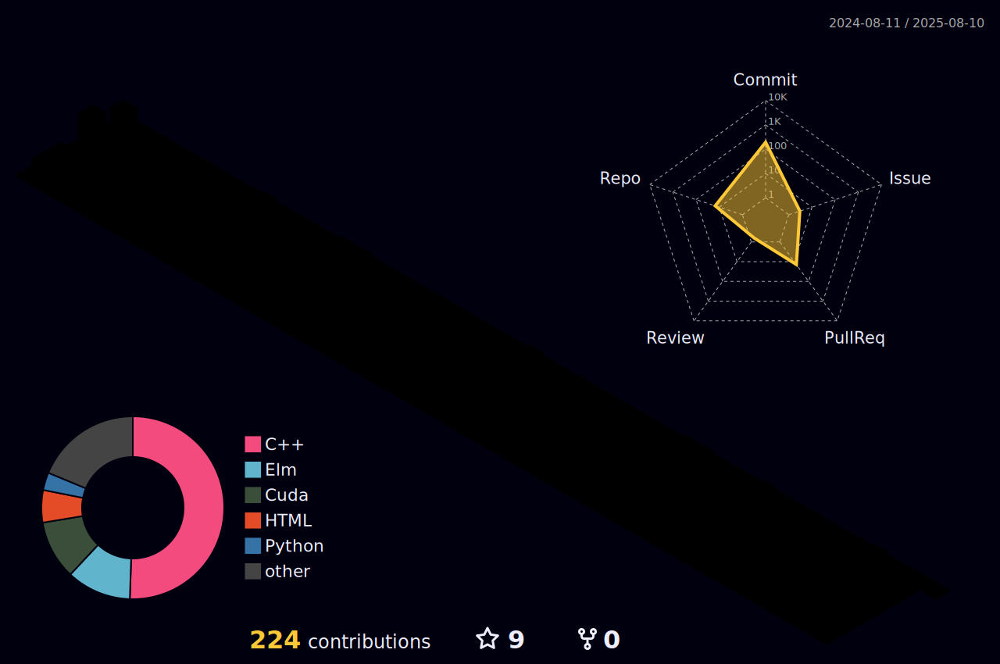

<!--  -->


<h2 align="center"> About Me: </h2>

<!--START_SECTION:waka-->


<!--END_SECTION:waka-->

🔭 Hello, I'm Risc_lt, a trivial undergraduate student from **@SJTU** and maybe somehow also **@UMich**. 

💻 I’ve learnt a litte **HPC(Graph)**, **Cloud(FaaS)**, **OS**, **DB(OLTP)** and **Web(FSD)**.

🌏 I’m currently working on **FaaSBoard**, **chfs** and **jCourse**.

<!--⚡ I'm seeking research opportunities and internship in **MLSys** and **DB**.-->

📜 I'm a big fan of **Golden State Warrior** and I enjoy listenning to **popular music** as well as playing **video games**.

🌱 I'm used to being strictly **organized on a schedule** and pretty annoyed if any sudden interruption.

📫 How to reach me: **Ruan_lt@outlook.com**

<div>
  
  
</div>

<!--
## Projects
- [xv6-riscv](https://github.com/Risc-lt/xv6-riscv) (A re-implementation of Dennis Ritchie's and Ken Thompson's Unix Version 6.)
- [BusTub](https://github.com/Risc-lt/Bustub-KV) (A relational database management system supporting transaction processing, recovery and so on.)
- [jCourse](https://github.com/SJTU-jCourse) (A community platform for SJTUer based on React.js and Vite for front-end and Gin for back-end.)
- [LSM-KV](https://github.com/Risc-lt/LSM-KV) (A key-value storage system based on LSM Tree and key-value separation technology based on modern C++.)
- [ebookstore](https://github.com/Risc-lt/ebookstore) (A fully functional website for a Bookstore online shop based on Next.js and SpringBoot.)
- [kitty](https://github.com/Risc-lt/kitty) (An install and custom tutorial for kitty virtual terminal.)
-->

<h2 align="center"> Recent activities: </h2>

<div style="text-align: center;"></div>

```text
🕑︎ Time Zone: Asia/Shanghai
```


<!--
**Timeline**


-->

**Contribution sheet**


<!--   profile-green-animate -->

<!-- -->

 
